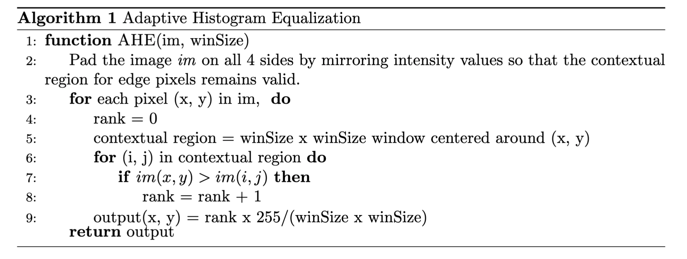
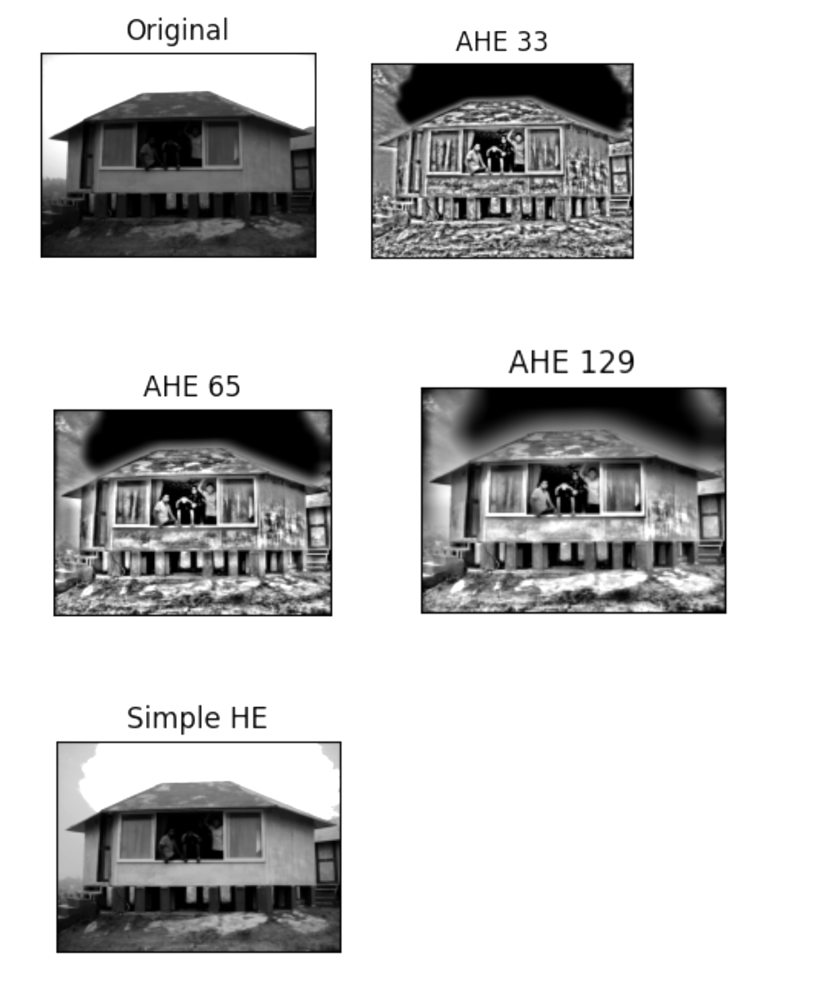

# Adaptive Histogram Equalization

## Yusuf Morsi
### Mar 22, 2023

In this project, I implement a function for adaptive histogram equalization (AHE), and evaluate it on an image, beach.png, for different contextual region sizes. I have it take in the image and contextual region as inputs, and it creates the enhanced image using a function that I wrote based on the pseudocode below. 

Below are images showing the original image, three pictures using AHE, and one image created with simple histogram equalization (HE). 

