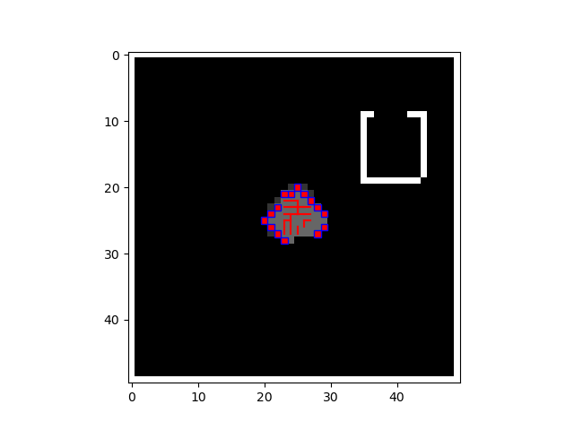

# Swarms with A* Algorithm

## Yusuf Morsi
### Mar 7, 2023

In this project, I use the A-star algorithm to calculate a route for 15 bots to travel and explore the entire map. I also called four functions; one for finding unexplored areas, one for getting a new destination, one for updating the explore map, and one for updating the position; which all came together to have the bots explore the entire map. 

In the algorithm, each bot was assigned to a target unexplored area and had to find the shortest route to get to that area with the A* algorithm. After arriving at the destination, the bot would update the explore map by marking the area as explored, and selecting a new destination. This continues until the entire map is explored.

When starting out, the graph looks like this:

Click [here](https://youtu.be/kFY0XEStgKA) to see a video of the bots swarming the map.