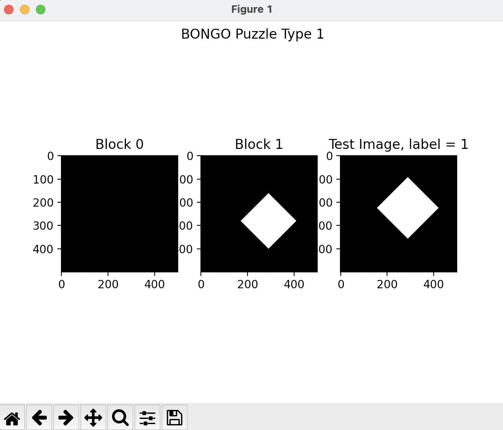
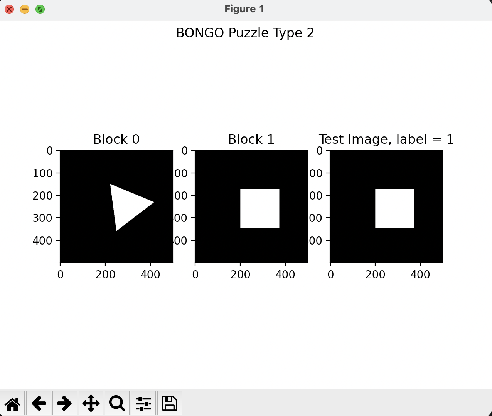
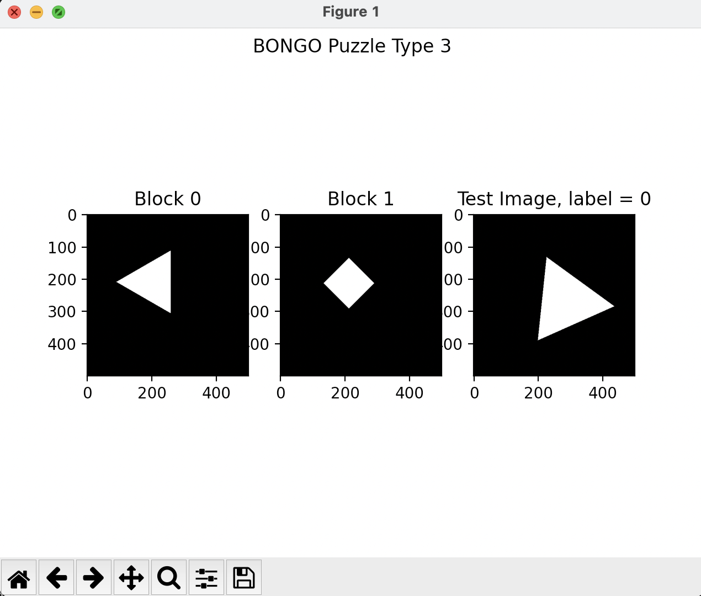
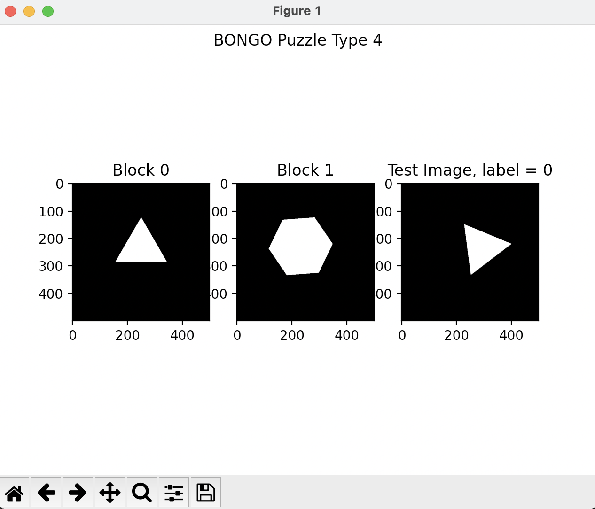

# CAPTCHA Classification: Solving BONGO Puzzles with Python

## Yusuf Morsi
### Feb 8, 2023

## Introduction
CAPTCHA, an acronym for Completely Automated Public Turing Test to Tell Computers and Humans Apart, is used to distinguish between computers and humans every day on the internet. One of the interesting CAPTCHAs is BONGO, which asks users to solve a visual pattern recognition problem. In this project, I built a simple visual recognition algorithm to hack a system similar to BONGO.

<hr>

## The 4 Puzzles

The following are the four types of puzzles that my algorithm was able to solve:

### Puzzle 1



### Puzzle 2




### Puzzle 3


### Puzzle 4


<hr>

## Implementation

After taking in a list of images (the first two being the ones the user selects from and the third being a test image), I use enumerate to loop through and save each as a .png file. Then, I use OpenCV's cv.imread function to read each image before converting to grayscale (cv.cvtColor), then subsequently applying a threshold. After that, I use cv.findCountours to find the contours of thresholded image. If no contours are found, a zero is added to a list, and if there are contours, the first one is selected and approximated with cv.approxPolyDP. The length is later added to the a. At the end, the first and third elements are compared, and the function returns a zero if they're equal. If not, a 1 is returned.

My performance is as follows:   

```
The accuracy of question 1 is 1.000000

The accuracy of question 2 is 1.000000

The accuracy of question 3 is 1.000000

The accuracy of question 4 is 1.000000
```

<hr>

Note: My Python code is private for Academic Integrity purposes.
