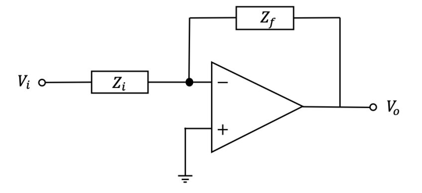

# Design and Analysis of High-Precision Differentiator Circuit

## Yusuf Morsi, Sharida Almutlaq
### Nov 28, 2023

## Introduction

In this lab, our main goal is to design and build a differentiator circuit. The main focus of this lab is calculating compensation resistor and capacitor values, confirming them through our LTSpice simulations, and coming up with the correct gain to meet given certain rise time and overshoot values. We made sure to utilize circuit analysis techniques and MATLAB simulations to analyze the circuit behavior under different conditions.

The work we conducted in this lab includes changing the circuit by incorporating compensation resistors and capacitors, and subsequently inspecting their impact on parameters such as the overshoot, rise time, unity gain frequency, and phase margin (MATLAB proved to be very helpful in this). Our main objective is to choose the best values for these, specifically making sure to target overshoot and rise time. We also made sure to create and include LTspice simulations and went through the trial and error process to determine the proper balance of components.

Through circuit analysis, LTspice simulations, and the circuit measurements we conducted in the UCSD Warren Lecture Hall lab, we were able to find the proper values for our compensation resistor and capacitor, all the while keeping records of our overshoot and rise time values.

To view the full report with LT spice and real-life circuit-level simulations, circuit analysis, and MATLAB plots + code, please contact <b>Yusuf Morsi</b> (ymorsi8@gmail.com) for the password for access to the <a href = "https://ymorsidiff.netlify.app">full report</a>.
