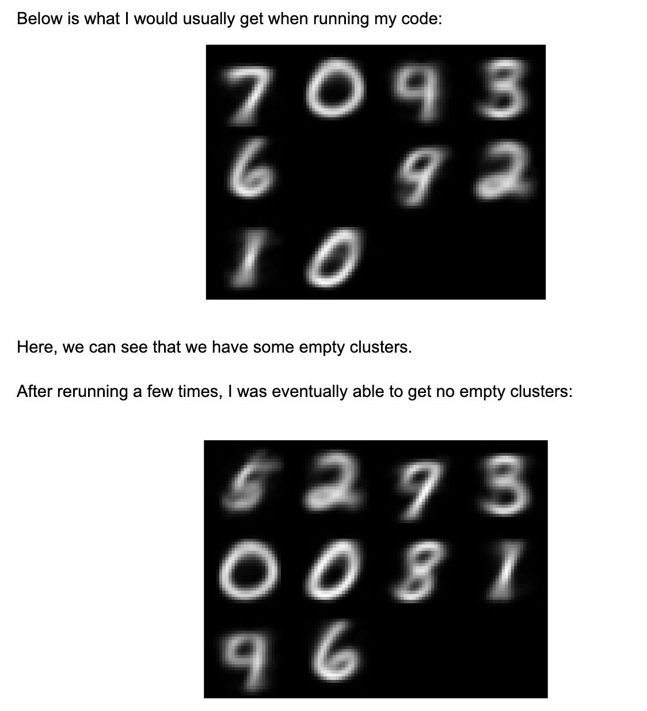
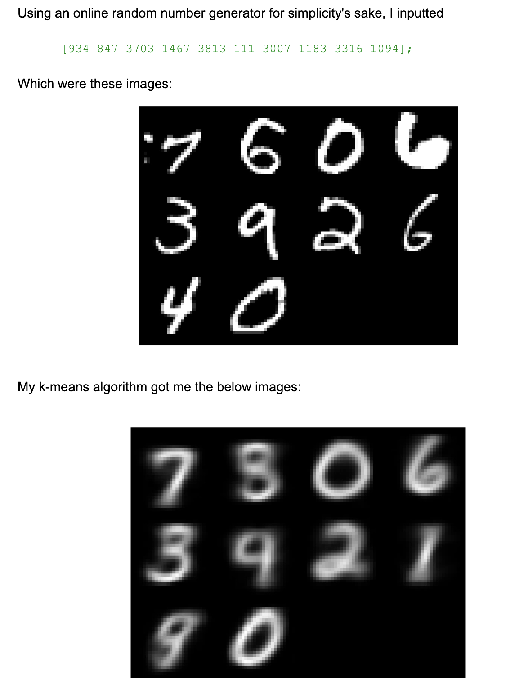
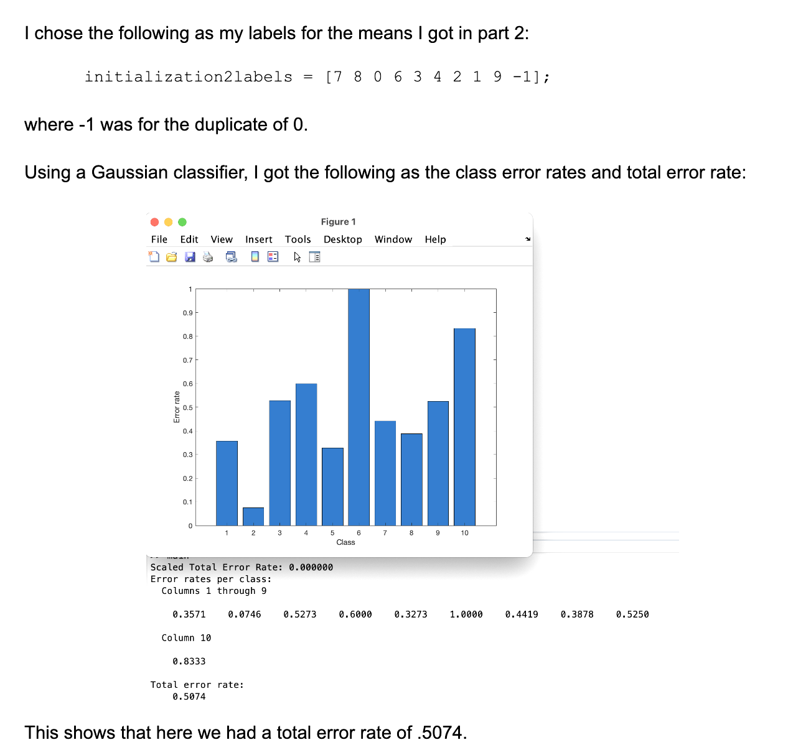
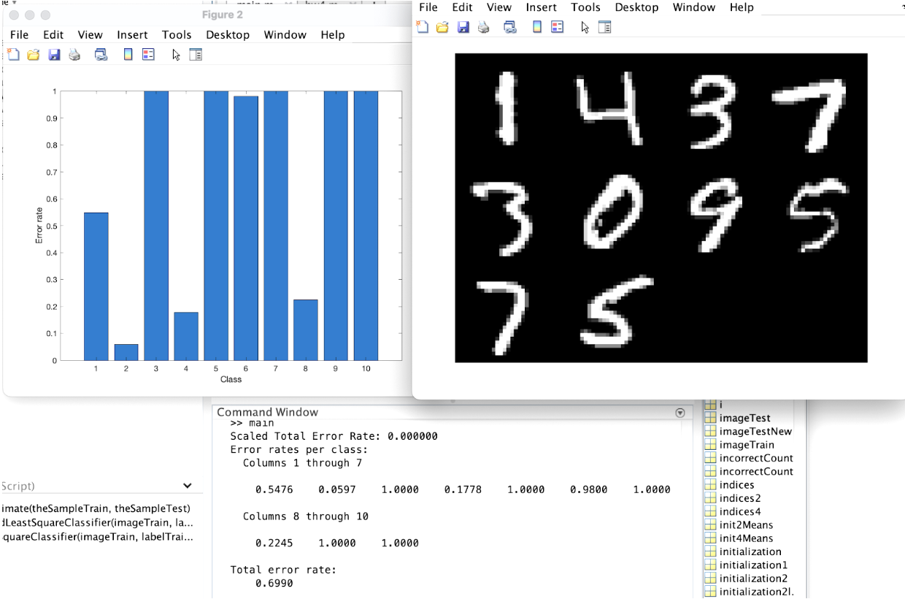

# K-Means Digit Classification

## Yusuf Morsi
### Mar 10, 2023

## Introduction

In this project, I will classify digits in an unsupervised manner, using K-means clustering. We will set a stopping criteria of .2%.

## 1

In part one of this project, I first considered 10 random initializations scaled to match the image intensity range, and run a K-means algorithm with them. The following is final class means that were yielded.

Here, we see that although we have 10 different numbers, two of them are identical, which can be because of the small number of initializations we use. This could be solved by rerunning after removing duplicates.

To assign a cluster mean, our algorithm calculates the Euclidean distance between each value and the cluser mean, and assigns it to the nearest mean, while the index of the nearest mean is stored in the prediction vector. This is a very basic implementation of the k-means algorithm.

In a nutshell, our k-means clustering algorithm takes in an input image and mean initializations, iteratively updates the means, and assigns values to the closest mean. We use the given stopping criteria of 10 changes per 5000 images.

## 2

For this part, instead of choosing random initializations for the classmeans, we choose 10 random images from the training data and assume it to be the initial class means. Below is what the K-means algorithm yields, and what images we get for final class means as grayscale images.

## 3 

Here, we manually assign labels (0-9) to the class means obtained in the above part. Below are the error rates per class and total error rates yielded: 

## 4

Here we repeat what we did in part 2 for another set of random images, and find that the means are different. It is clear that there is high sensitivity here when it comes to this initialization, as we keep getting drastically different images.

**Note:** the MATLAB code is private for Academic Integrity purposes.