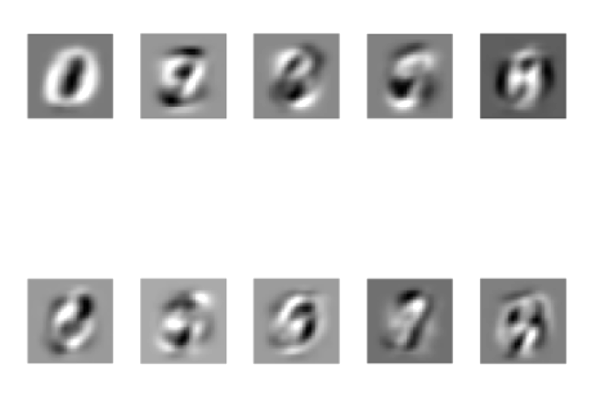
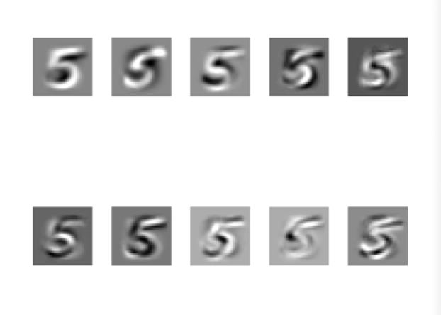
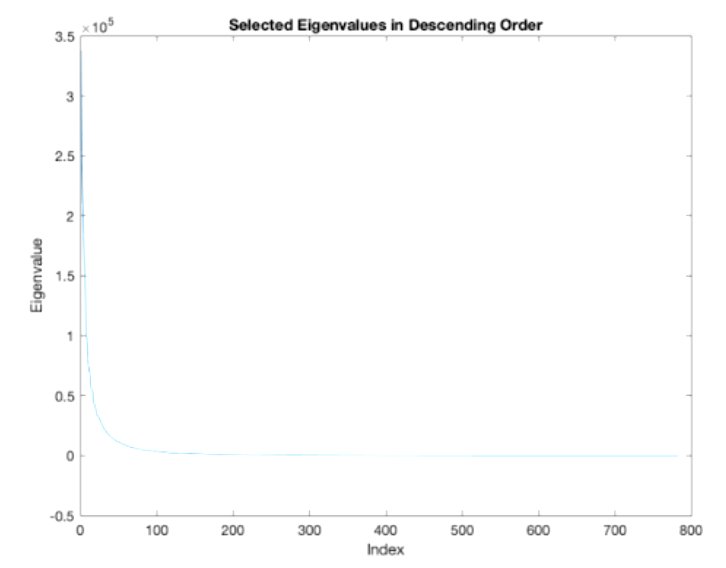
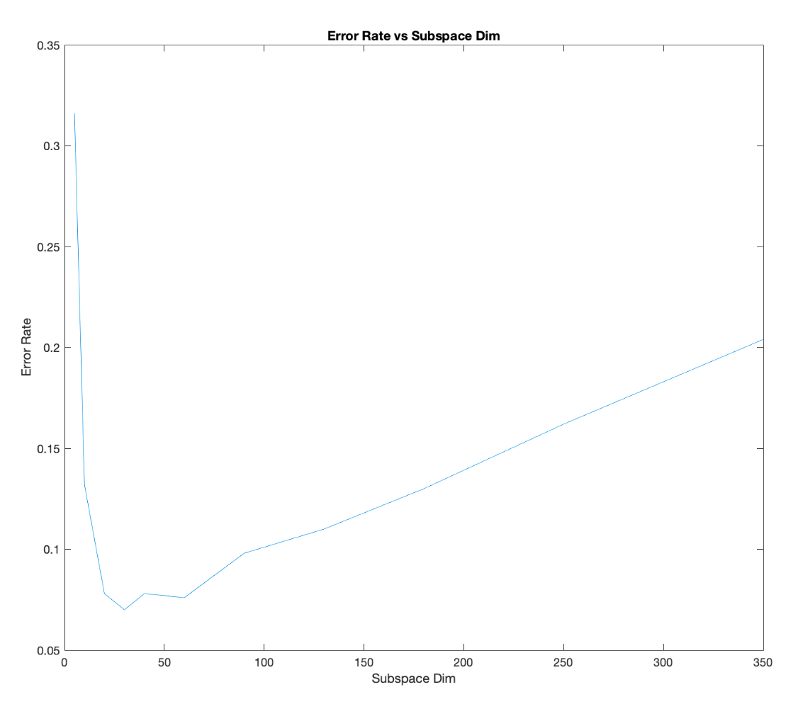

# PCA Algorithm for MNIST

## Yusuf Morsi
### Mar 17, 2023

## Introduction

Using PCA (principal component analysis), we will find the principal components for the MNIST dataset.

## 1

Here we implement the PCA algorithm and find the principal components for the entire training set. Below are plots of the top ten prinicpal components as 28x28 images.

Below we repeat the same thing for the class for the digit 5. 

Below is a plot of the eigenvalues of the entire dataset (in decreasing order).

## 2

Below we dsee the total error rate using subspaces of following dimensions: [5, 10, 20, 30, 40, 60, 90, 130, 180, 250, 350].

## 3

Using the principal components calculated for the digit 5 above, we now find the image from the test set that looks least like the number 5, which has the maximum energy in the direction orthogonal to the subspace spanned by the principal components of class 5 (here we assume that the top 40 eigenvectors are the principal components).

Below is the image that looks least like the number 5:

**Note:** the MATLAB code is private for Academic Integrity purposes.